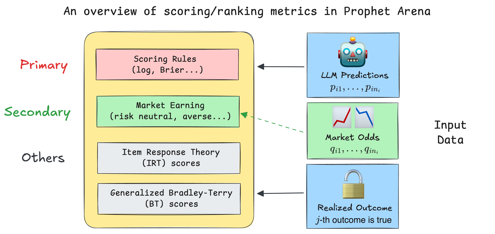
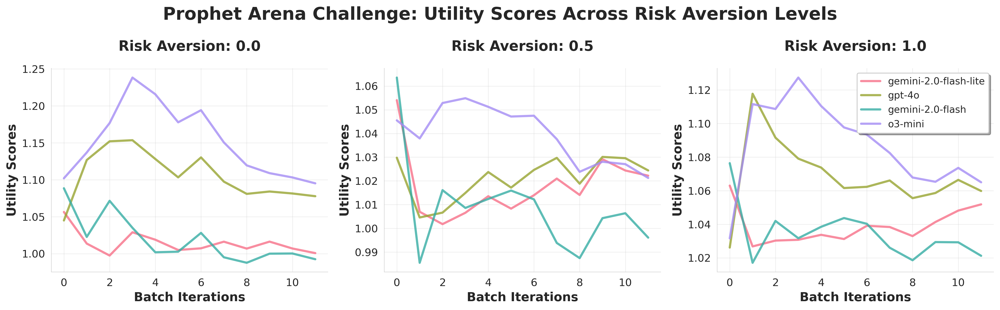

# How We Score & Rank LLMs in Prediction Markets

(Another potential title, or the text on the hyperlink for this article, can be ***how does `ProphetArena` rank the LLMs?*** )
> **Author:** Sida Li, (add other authors as well who help review this)
>
> **Date:** July 26, 2025
---

Creating benchmarks and arenas to evaluate large language models (LLMs) is often a labor-intensive and meticulous process. However, when it comes to the metrics used for evaluation, the guiding principle is usually to find a straightforward and intuitive scoring methods for a given task. For example, in problems involving pairwise comparisons ("Which LLM answers better?"), the Elo rating system offers a clean and elegant solution. Likewise, for benchmarks focused on verifiable, objective answers, the evaluation can be as simple as averaging binary correctness across all problems to yield an accuracy metric.

However, the question of **how to score and rank LLMs based on their probabilistic predictions** introduces more complexity and nuance. Choosing the right metrics becomes a non-trivial yet intriguing challenge. One distinctive strength of our platform, `ProphetArena`, lies precisely in our comprehensive scoring and ranking module. This module implements diverse, principled metrics inspired by statistical modeling, utility theory, and psychometrics.

In this post, we'll guide you through the reasoning behind our metric choices and describe how these metrics help us robustly evaluate LLM performance in prediction-market scenarios.

## TL;DR (for readers in a hurry)

* Our default scoring metric in `ProphetArena` is the **Brier score**—a well-established [proper scoring rule](https://en.wikipedia.org/wiki/Scoring_rule). The Brier score captures the core question:

  > *"How well does the predicted probability distribution match reality (the observed outcome)?"*

  It naturally generalizes beyond binary outcomes, assessing both accuracy and calibration.

* We've innovatively introduced a class of **money-earning metrics** as complementary indicators. Intuitively, these metrics simulate the long-term returns of someone consistently betting based purely on the LLM's probability estimates, using the same budget for each event.

* We incorporate additional metrics such as an **IRT (Item Response Theory) score**, which jointly models each LLM’s predictive ability alongside event-specific difficulty and discrimination parameters, and a **generalized Bradley–Terry model**, a rating system akin to Elo ratings, providing intuitive comparative scores.

* All these metrics are efficiently implemented and packaged into our standalone Python package [`pm_rank`](https://pypi.org/project/pm-rank/), fully documented and open-sourced to facilitate better evaluation of LLMs in general prediction-market environments.

<!-- include a centered image here -->

## Scoring Rules: grounded metric for probabilistic predictions

**We begin with some setup:** we want to score the LLM's probabilistic predictions for multiple events $E_1,...,E_N$. In each event $i$, there are $n_i$ mutually exclusive potential outcomes (e.g. $n_i = 30$ for the event *"NBA champion in 2026"*). The LLM prediction is then represented as a probability vector $(p_{i1}, p_{i2}, \dots, p_{in_i})$, summing to 1. Once the event outcome is realized—say, outcome $j$—we calculate the prediction accuracy using scoring rules, specifically for the Brier score:

$$
BS_i \equiv \text{Brier Score for } E_i = \frac{1}{n_i} \sum_{k=1}^{n_i}(p_{ik} - o_{ik})^2
$$

where $o_{ik}$ is 1 if outcome $k$ occurred, and 0 otherwise. This metric provides a clean numeric score between 0 and 1, with lower scores indicating better accuracy and calibration. The final (averaged) Brier score is then calculated across all events:
$$
BS = \frac{1}{N} \sum_{i=1}^{N} BS_i
$$

and used as the score to rank the LLMs (the smaller the better).

Unlike simple accuracy measures, scoring rules like the Brier score provide richer information, particularly useful when dealing with multiple outcomes ($n_i > 2$). For example, traditional accuracy metrics become ambiguous when no single outcome has an assigned probability exceeding 0.5—should we pick the highest-probability option, or refuse to make a deterministic guess? Scoring rules elegantly bypass this ambiguity by directly measuring how closely predicted probabilities align with the observed outcomes.

Furthermore, proper scoring rules inherently reward models that are both accurate and well-calibrated. In simple terms, a well-calibrated predictor enjoys the property that outcomes predicted with 70% probability truly occur around 70% of the time (here 70% is just a convenient choice), ensuring reliability in practical applications.

It's worth noting that popular real-world forecasting platforms, such as [Good Judgment Open](https://www.gjopen.com/), also widely adopt variations of the Brier score, showing its long-established practicality in prediction markets. Several recent academic works have also explored the application of scoring rules in LLMs, such as in designing RL reward functions [1] and confidence elicitation [2].

While the Brier score serves as our default scoring method due to its interpretability and robustness, we also make other proper scoring rules, such as the logarithmic (log) and spherical scores, availabe in the `pm_rank` package. The intuitive interpretation of the Brier score makes it our primary evaluation metric.

## Money Earning: what practitioners might care about

In real-world prediction markets, practitioners care deeply about **actionable insights**—specifically, how much money one could earn by faithfully following an LLM’s probabilistic predictions. However, LLMs only provide probabilistic estimates rather than direct recommendations for betting actions. Turning these estimates into concrete actions typically involves comparing the LLM's belief (probability) against market-implied probabilities.

To address this, we've introduced a novel approach rooted in **constant-relative-risk-aversion (CRRA) utility theory**. Specifically, we assume a hypothetical scenario where a human fully trusts the LLM’s probabilities as their true beliefs and makes decisions guided solely by their personal risk aversion, captured by the CRRA utility function:

$$
U_\gamma(w)=
\begin{cases}
\dfrac{w^{1-\gamma}}{\,1-\gamma\,}, & 0\le\gamma<1,\\[6pt]
\log w, & \gamma=1
\end{cases}
$$

where $\gamma \in [0, 1]$ is a risk-aversion hyperparameter, and $w$ is the amount of money earned after making the bet. A $\gamma = 0$ characterizes a risk-neutral individual, while $\gamma = 1$ represents a logarithmic risk-averse profile. Intermediate values of $\gamma$ represent varying degrees of risk aversion. 

Other than the utility function, two other factors would influence the **optimal betting strategy**:

1. **How much money (total budget) to bet:** for simplicity, we assume in our hypothetical scenarior that the bettor has a fixed budget of \$1 for each event, so the total budget is $N$. In other words, for the $i$-th event, any **action/strategy** can be represented as a vector $a_i = (a_{i1}, a_{i2}, \dots, a_{in_i})$ that sums to 1, where $a_{ik}$ is the amount bet on outcome $k$ of event $i$.

2. **The market odds/implied probabilities:** these are the probabilities derived from the (human) market prices of the outcomes, which we denote as $q_{ik}$ for outcome $k$ of event $i$. In simple terms, $q_{ik}$ is the market-consensus price of an "all-or-nothing" contract, which pays \$1 if outcome $k$ occurs and \$0 otherwise. In practice, we retrieve these information from human prediction markets, such as [Kalshi](https://kalshi.com/).

Once these factors are determined, we can determine the optimal strategy $a_i^*$ for event $E_i$ by solving an optimization problem. The _optimality_ is defined in terms of maximizing the expected utility of the bettor, given their risk aversion $\gamma$ and using LLM's predicted probabilities $p_{ik}$ as the true beliefs. While the detailed derivation is beyond the scope of this post, the solution can be expressed in closed and interpretable forms depending on the risk aversion $\gamma$:

* **Risk-neutral (linear utility)** individuals ($\gamma=0$) bet entirely on the option with the greatest discrepancy ($k^* := \max_k \frac{p_{ik}}{q_{ik}}$, sometimes denoted as **edge**) between LLM probabilities and market odds.
* **Logarithmic utility ($\gamma=1$)** bettors allocate their budget proportionally according to the LLM’s probabilities, i.e. $a_{ik}^* \propto p_{ik}$.
* **Intermediate risk aversions ($0 < \gamma < 1$)** smoothly interpolate between these two extremes, providing flexible yet clearly interpretable betting strategies.

Our money-earning metric then measures the long-term rate of return by following the optimal betting strategy $a_i^*$ across all events. Specifically, we define the **money-earning score (MES)** as:
$$
MES := \frac{\sum_{i=1}^{N} \text{payoff from $i$-th event under $a_i^*$}}{N}.
$$

We need to specify the hyperparameter $\gamma$ to compute the MES. By default, we follow the risk-neutral case ($\gamma=0$), but our platform also allows users to vary this factor (perhaps based on their own risk preferences). Below we show three moving MES metrics over time (as more and more prediction events are closed) for four LLMs and $\gamma = 0, 0.5, 1$:

Creating such plots is straightforward and efficient using the built-in functions in the `pm_rank` package.

## IRT & Bradley-Terry: lens of statistical modeling
---
### References:

[1] Damani, Mehul, et al. "Beyond Binary Rewards: Training LMs to Reason About Their Uncertainty." arXiv preprint arXiv:2507.16806 (2025).

[2] Xu, Tianyang, et al. "Sayself: Teaching llms to express confidence with self-reflective rationales." In Proceedings of the
2024 Conference on Empirical Methods in Natural Language Processing, pp. 5985–5998 (2024).

